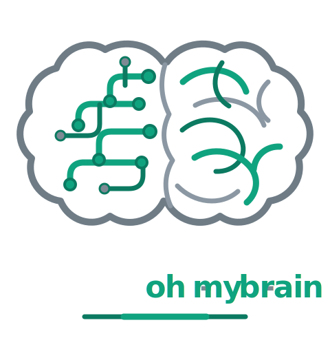
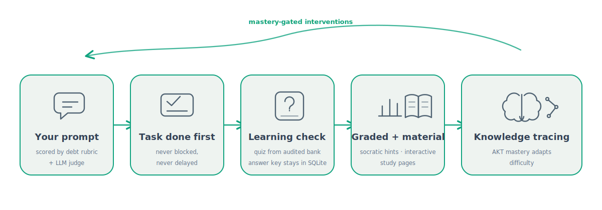
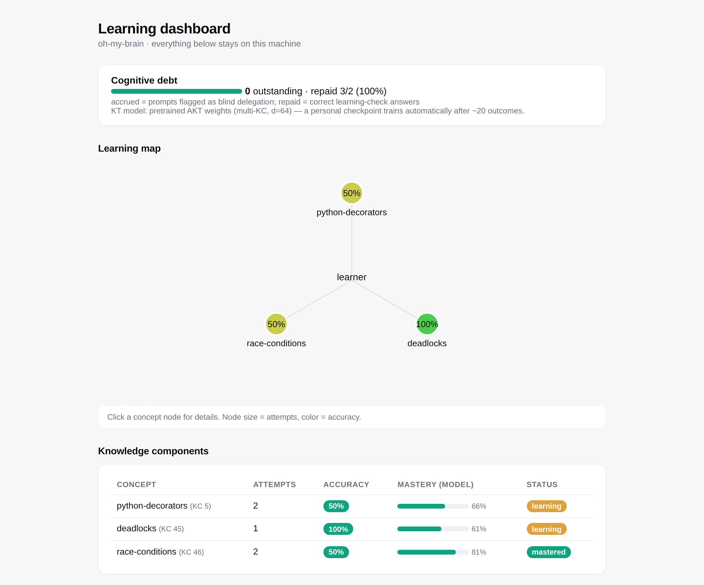
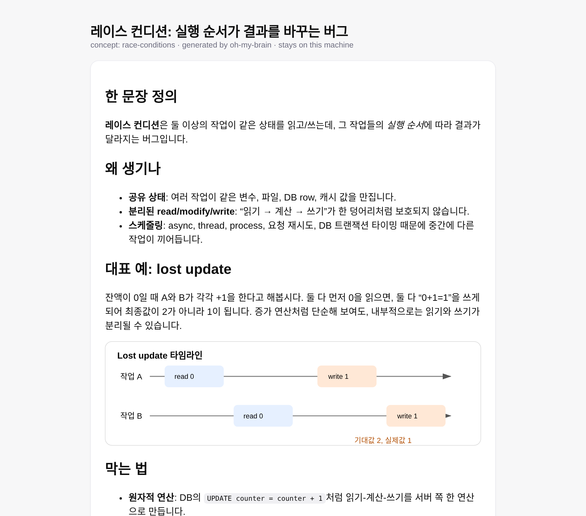

<p align="center">
  
</p>

<h1 align="center">oh-my-brain</h1>

<p align="center">
  <strong>Delegate the work. Keep the understanding.</strong><br />
  A coding-agent harness that measures and repays your <em>cognitive debt</em> — the understanding
  you silently lose every time an AI does the work for you.
</p>

<p align="center">
  <a href="LICENSE"></a>
  <a href="https://github.com/Yeachan-Heo/gajae-code"></a>
  
  
</p>

<p align="center">
  
</p>

## What is oh-my-brain?

Every prompt you fire at a coding agent trades a little understanding for a
lot of speed. oh-my-brain is a harness **built into the agent runtime
itself** (a fork of [Gajae-Code](https://github.com/Yeachan-Heo/gajae-code) —
see [References](#references)) that keeps that trade honest:

- it **never blocks or slows your task** — the work always ships first;
- when a prompt looks like *blind delegation* (no stated intent, no
  constraints, no verification plan), it appends exactly **one** short
  learning check to the reply;
- your answers feed a local **knowledge-tracing model**, so interventions
  fade as your mastery grows and sharpen where you are weak;
- everything — prompts, outcomes, mastery, materials — stays in
  `.gjc/oh-my-brain/` inside your project. Nothing leaves your machine.

Because the harness lives *inside* the agent loop (not in external hooks),
it can steer **mid-task check-ins** into long-running turns, render a live
**debt status bar** in the TUI footer, and withhold quiz answers
**structurally**: bank quizzes are served by the `omb_quiz` tool with the
answer key stored only in local SQLite — the model never sees it, so it
cannot leak it, even if you ask nicely.

## The learning dashboard

Every graded answer updates a self-contained local dashboard: a per-concept
learning map, model-backed mastery meters, outcome history, and the running
cognitive-debt ledger (accrued on blind delegation, repaid by correct
answers).

<p align="center">
  
</p>

## Interactive study materials

Wrong answer? The agent generates a styled, self-contained study page —
explainer, diagrams, mini-simulations, and a **recorded quiz** whose
browser clicks POST straight into your learner record through a local
study server.

<p align="center">
  
</p>

## Pretrained knowledge tracing

Fresh installs don't start dumb. The bundled AKT weights were pretrained on
a **synthetic, quality-gated, ASSIST09-scale dataset** (4,000 simulated
learners, ~290k interactions over the harness's 100-concept catalog)
generated with small local LLMs on a single GPU — including a measured
negative result about what small-model role-play *cannot* do, and a
KC-vocabulary saturation study. The full story is in the
[technical report](python/oh-my-brain-kt/synth/TECHNICAL_REPORT.md).

| | value |
|---|---|
| question bank | 1,461 items, answer keys audited by a stronger model |
| dataset | 4,000 students · 289,752 interactions · 100 KCs |
| quality gates | difficulty ρ 0.94 · learner separation 0.25 · learning slope +0.025 |
| held-out AUC | 0.667 (KC-only oracle ceiling ≈ 0.72) |
| runtime inference | pure TypeScript, in-process — no Python needed |
| personalization | local PyTorch retrain (warm-started) every 20 real outcomes |

## Quick start

```sh
bun install
bun --cwd=packages/natives run build                         # native addon (Rust toolchain)
bun packages/coding-agent/src/cli.ts setup credentials --yes # import Codex/Claude auth
bun packages/coding-agent/src/cli.ts                         # run — oh-my-brain is built in
```

First session onboards you automatically. Then just work; the harness stays
out of the way until it has something worth asking.

| Surface | What you get |
|---|---|
| `/omb-status` | the cognitive-debt status bar |
| `/omb-dashboard` | rebuild + link the learning dashboard |
| `/omb-study` | local study server (serves materials, records quiz clicks) |
| `omb_quiz` / `omb_quiz_answer` | audited bank quizzes, answers structurally withheld |
| `omb_grade` / `omb_mastery` / `omb_material` / `omb_prefs` | grading, mastery lookup, material pages, enforced preferences |

## Layout

- `packages/coding-agent/src/defaults/gjc/extensions/oh-my-brain/` — the
  harness: debt rubric + session-model judge, SQLite learner record with
  fuzzy KC normalization, bank quizzes, TS AKT inference, dashboard, study
  server, mid-session check-ins
- `python/oh-my-brain-kt/` — knowledge-tracing pipeline: AKT model,
  synthetic-dataset generation (vLLM + small local models), pretrained
  weights, technical report
- `packages/coding-agent/test/oh-my-brain.test.ts`,
  `python/oh-my-brain-kt/tests/` — test suites (`bun test` / `pytest`)
- `legacy/codex-prototype/` — the original OpenAI Codex CLI hook/skill
  prototype this project grew out of
- everything else — the Gajae-Code agent framework this project builds on

## References

This project is built on **Gajae-Code**, an open-source coding-agent
framework (MIT): the runtime, TUI, tool system, and extension surface all
come from it, and oh-my-brain is implemented as a bundled extension inside
it. Upstream attribution is preserved in `LICENSE` and `NOTICE.md`.

> Yeachan Heo. *Gajae-Code: a focused coding-agent runner for interviews,
> reviewed plans, tmux-native execution, and durable verification.*
> https://github.com/Yeachan-Heo/gajae-code (MIT). Imported at upstream
> v0.10.2; the original framework README is preserved at
> [`docs/GAJAE-CODE-README.md`](docs/GAJAE-CODE-README.md).

The knowledge-tracing model is a compact variant of AKT:

> Aritra Ghosh, Neil Heffernan, Andrew S. Lan. *Context-Aware Attentive
> Knowledge Tracing.* KDD 2020.

## License

MIT — see [`LICENSE`](LICENSE) and [`NOTICE.md`](NOTICE.md).
